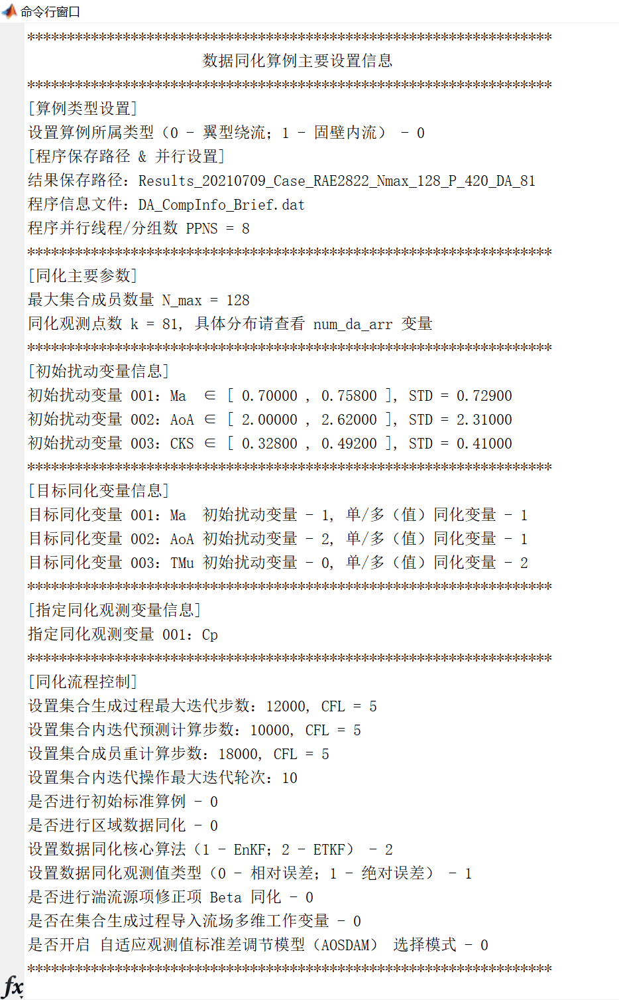
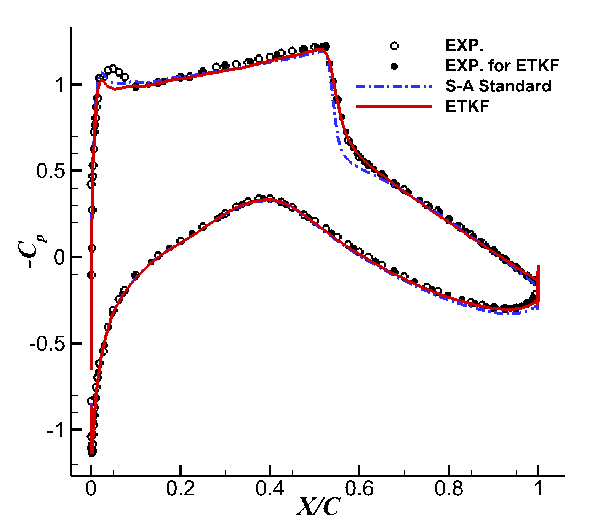

# Data assimilation program for turbulent flows (DATF) Version 1.0

# **湍流数据同化程序 V 1.0（使用说明）**

[](https://pkufzh.github.io/) [](https://www.researchgate.net/profile/Zhenghao-Feng) [](https://space.bilibili.com/167343763) [](https://github.com/pkufzh)

# 0 程序介绍 #

**程序名称：Data assimilation program for turbulent flows (DATF) 湍流数据同化程序**

**作者：西北工业大学2017级本科生冯铮浩**

**联系邮箱：nwpufzh@mail.nwpu.edu.cn**

<font color = 'red'>**注意：本程序测试平台采用 In-house CFD codes，无法开源，故用户需要自己提供主程序端口，本程序仅提供湍流数据同化框架。**</font>

<font color = 'red'>**本仓库中的所有关于数据同化核心代码全部由作者原创。任何形式的转发引用请务必注意标明出处！请尊重作者劳动成果！**</font>

<font color = 'blue'>**西北工业大学航空学院2021届本科毕业设计论文《翼型绕流的数据同化方法研究》源程序**</font>

<font color = 'blue'>**本论文获得2021年全国高校航空航天类专业本科毕业设计成果交流会个人项目一等奖。**</font>

# 1 程序整体框架

​	本文介绍基于广义滤波方法的湍流数据同化通用程序，主要由前处理模块、同化算法模块与后处理模块三部分组成。程序提供了实验数据与求解器外部接口，预期可用于融合实验与计算结果的实时流场状态估计。目前程序整体框架为 MATLAB（主要用于实现流程算法）与外部计算流体力学（CFD）程序或软件（主要用于调用求解）的组合模式，程序框架初步搭建完毕，各子程序与函数已完成封装，可根据需求便捷修改参数后，快速启动同化算例，且能实现单核 CFD 求解器并行窗口运行。程序整体框架如图 1-1 所示。


<center><font size = 3.5> 图 1-1  基于广义滤波同化方法的通用程序框架示意图 </font></center>

# 2 程序概况

​	本湍流数据同化程序概况如图 2-1 所示。下面对程序包含的文件与文件夹及其功能进行介绍。

​    源代码存放目录：Release_DATF_ETKF_Airfoil_Beta


<center><font size = 3.5> 图 2-1  湍流数据同化程序概况 </font></center>

​	在以下运行环境中，MATLAB主程序 + 封装CFD求解器 算例测试通过：

- 操作系统：Windows 10 64-bit；
- 数值软件：MATLAB R2017a (及以上版本均可)；
- CFD求解器：如 GFSI 、风雷、 CFL3D等按照一定规则修改后可直接植入。**注意：本程序测试平台采用 In-house CFD codes，无法开源，故用户需要自己提供主程序端口，本程序仅提供湍流数据同化框架。**

## 2.1 数据同化主程序

- <font color = 'red'>***DA_EnKF_ETKF_Parallel_Common.m***</font>

  **数据同化主程序。**功能：利用广义滤波方法，结合实验数据，实现对翼型绕流等算例的数据同化。

  本程序的同化算法可根据算例特点，选用集合卡尔曼滤波（EnKF）或集合变换卡尔曼滤波（ETKF）。

## 2.2 辅助子函数

- <font color = '#FF00FF'>***State_Ensem_Gen_Parellel_Common_Beta_BL.m***</font>

  **（主要函数）**功能：实现数据同化集合成员的初始化（并窗口运行）

- <font color = '#FF00FF'>***State_Ensem_Renew_Parellel_Common_Beta_BL.m***</font>

  **（主要函数）**功能：实现数据同化内迭代过程的预测步（并窗口运行）

- <font color = '#FF00FF'>***State_Ensem_Recal_New_Common_Beta_BL.m***</font>

  **（主要函数）**功能：实现数据同化流场重计算

- <font color = '#87CEFA'>***DA_Extension_Airfoil_Interpolation.m***</font>

  功能：（翼型）外形（输出）插值函数

- <font color = '#87CEFA'>***DA_Extension_NonAirfoil_Interpolation.m***</font>

  功能：（非翼型）算例外形（输出）插值函数

- <font color = '#87CEFA'>***DA_Va_Airfoil_Ref_Adjustment_and_Visulization.m***</font>

  功能：（翼型）对计算压力系数曲线节点编号进行梳理，并实时输出当前同化轮次压力分布曲线


- <font color = '#87CEFA'>***DA_Extension_NonAirfoil_Interpolation.m***</font>

  功能：（非翼型）对计算压力系数曲线节点编号进行梳理，并实时输出当前同化轮次压力分布曲线

- <font color = '#87CEFA'>***Region_Beta_Dots_Selected.m***</font>

  功能：在开启区域数据同化后，对所选定区域内的网格单元进行平面随机采样

- <font color = '#87CEFA'>***shadedplot.m***</font>

  功能：辅助绘制包络阴影区域
## 2.3 外部数据 & 封装CFD求解器

- <font color = 'blue'>***文件夹：Input_Data***</font>

  用于存放实验数据文件，包括翼型表面压力系数分布、边界层速度型等，以及翼型外形数据文件。

- <font color = 'blue'>***文件夹：Program_CFD_Base***</font>

  用于存放封装后的CFD求解器，包括 Input 输入参数文件夹，Output 输出结果文件夹，CFD 头文件文件夹， GridTreat_.exe 网格转换程序，求解主程序，以及批处理文件。

# 3 程序说明

## 3.1 参数设置与前处理模块

### 3.1.1 主要功能说明

​	本模块主要功能是对集合成员与同化流程进行设置。根据算例具体要求，在设置集合成员部分，能够指定集合成员变量、集合成员数量、集合扰动区间；在设置同化流程部分，能够指定状态变量、设计同化区域、选择同化算法、设置程序并行，另外本模块可对整个湍流数据同化流程的关键参数进行调整与控制。

### 3.1.2 详细代码说明

​	下面对参数设置与前处理模块进行详细代码说明。通常，对于一个新的数据同化算例，只需要修改该部分输入参数即可。

- **<font color = 'red'>设置全局续算开关</font>**
  - 可默认 flag_da_xusuan = 0 不开启续算，则程序从全部初始化状态开始计算。若开启续算，即 flag_da_xusuan = 2，则需要指定同化中断轮次  - p，跳过集合成员初始化阶段，开始续算。

*对应程序段：*

```matlab
%% 设置同化程序全局续算开关
flag_da_xusuan=0; % 设置是否进行全同化程序续算
                  % 0 - 不开启续算；
                  % 1 - 开启中断续算，可导入任意中断后保存.mat文件后自由调整同化参数，开始进行续算；
                  % 2 - 直接定位至指定同化轮数 p 的保存文件，开始续算；
%% 初始化操作
% 若不开启续算，则清理所有工作区变量
if (flag_da_xusuan==0)
    clear all
    clc
    clf
    close all
    flag_da_xusuan=0;
    p=0; % 初始化同化轮数 p
elseif (flag_da_xusuan==2)
    clear all
    flag_da_xusuan=2;
    p=1; % 定位至指定同化轮数 p，继续同化
end
```

-  **<font color = 'red'>设置主要文件交互与并行相关参数</font>**
  - 通常仅需根据算例修改 ***savename*** 字符串，重命名结果根文件夹即可，其他各路径名称可保持默认。
  - 在根文件夹下，存放所有结果文件，其中 ***DA_CompInfo_Brief.dat*** 保存同化过程的所有提示信息。
  - 由于 CFD 程序仅能调用单线程进行计算，故本程序通过实现多窗口运行，来同时计算多个集合成员状态，以提升计算效率。实际可根据工作机线程数，设置并行线程/分组数 ***PPNS***。需要注意的是：这种处理方式并不是真正实现程序并行（例如：mpi / OpenMP），同时考虑多开程序，会导致内存占用较大、线程切换效率损失较高，故推荐设置的并行线程/分组数为总线程数的50%~75%。

*对应程序段：*

```matlab
% ------------  设置主要文件交互与并行相关参数 START ------------ %

% 设置数据交互路径
savename='Results_20210604_Case_S809_AoA_12.2_Nmax_120_P_199_DA_58_Beta';
ddir_recal=('Program_NWind2D_Parallel_Recal');  % 设置重计算路径
ddir_post=('Program_NWind2D_Parallel_Post');    % 设置结果后处理路径
new_output_folder=['.\',savename,'\'];

% 若不开启续算开关，则直接建立新文件夹，保存计算结果
if (flag_da_xusuan==0)
    mkdir(new_output_folder);
    mkdir(['.\Output_Figures\',savename]);
end
% 若开启指定续算开关：直接定位至指定同化轮数 p 的保存文件，开始续算（注意：指定同化轮数必须已经计算完毕）；
if (flag_da_xusuan==2)
    load([new_output_folder,savename,'_S_Va_pre_restart_',num2str(p,'%03d'),'.mat']);
end
% 重启/续算模块设置完毕

targetPath=new_output_folder;
initPath='Init_Ensemble_Member';

% 打开记录程序信息文件
fid_info=fopen([new_output_folder,'DA_CompInfo_Brief.dat'],'w+');
fid_all=fopen([new_output_folder,'DA_CompInfo_Detailed.dat'],'w+');

% 设置并行线程/分组数（可根据工作机线程设置）
PPNS=4;

% -------------  设置主要文件交互与并行相关参数 END ------------- %
```
-  **<font color = 'red'>设置生成初始集合成员相关参数</font>**
  - 设置初始扰动变量模块：定义变量名称 ***turbName*** （可设置为湍流常数、马赫数 Ma、迎角 AoA等）；指定输入参数文件的相对路径 FilePath 、修改行数 ModiLine 、修改格式 ModiFormat ；指定初始扰动变量扰动区间。
  - 利用拉丁超立方抽样方法进行初始扰动变量采样。
  - 设置目标同化变量模块：定义变量名称 ***targetName***（可设置为涡粘系数、马赫数 Ma、迎角 AoA等）；说明目标同化变量类型 TypeTurb 与 TypeDA 。
  - 设置同化观测变量模块：定义变量名称 ***refName***（可设置为压力系数分布 Cp、摩擦阻力系数分布 Cf、边界层速度型 BL等）。
    - 若目标观测变量为 Cp, Cf, yplus：设置参与同化过程的翼型数据点编号，建立同化数据点序号数组 ***num_da_arr***，可根据重点区域进行标志。
    - 若目标观测变量为边界层速度型，则需要指定边界层站位数量、导入各站位观测信息（y/c,u/u_ref）、各站位处边界层同化位置。

*对应程序段：*

```matlab
% -------------  设置主要文件交互与并行相关参数 END ------------- %

% -------------  设置生成初始集合成员相关参数 START ------------- %

% 定义集合成员最大数量（注意：实际的 N_new ≤ N）
N_max=120;

% ----------  指定初始扰动变量、目标同化变量、同化观测变量模块 START ---------- %

% ① 指定初始扰动变量模块（目前默认为单变量扰动）
% 算例标准状态设置
% 定义初始扰动变量名称、文件路径、修改行数、修改格式（均用数组表示，一一对应）
% 初始扰动变量名称
S_Va_turb_Name=["Cb1","Sigma","Cv1","CKS"];
% S_Va_turb_Name=["Beta"];
S_Va_turb_CharName=char(S_Va_turb_Name);
% 初始扰动变量类型：0 - 常数变量及其组合；1 - 空间分布变量
S_Va_turb_Type=0;
% 初始扰动变量个数
S_Va_turb_Num=length(S_Va_turb_Name);
% 初始扰动变量文件路径（省略运行程序根目录）
% S_Va_turb_FilePath_raw=char('\Input\InputNS.dat','\Input\InputNS.dat','\Input\InputTurb.dat');
% S_Va_turb_FilePath=strip(S_Va_turb_FilePath_raw,'right');
S_Va_turb_FilePath=["\Input\InputSAconst.dat","\Input\InputSAconst.dat","\Input\InputSAconst.dat","\Input\InputSAconst.dat"];
% 初始扰动变量修改行数（对应文件内）
S_Va_turb_ModiLine=[3,5,6,7];
% 初始扰动变量修改格式（对应文件内）
S_Va_turb_ModiFormat=["%-16.5f","%-16.5f","%-16.5f","%-16.5f"];
% 初始扰动变量扰动区间
% 设置扰动方式：0 - 绝对值上下扰动；1 - 比例上下扰动（例如：设置50代表扰动区间为标准值的[50%,150%]）
S_Va_turb_way=[1,1,1,1];
S_Va_turb_Std=[0.1355,(2/3),7.1,0.41];  % 初始扰动变量标准值
S_Va_turb_Det_base_lower=[10,10,10,10];  % 初始扰动变量下区间
S_Va_turb_Det_base_upper=[10,10,10,10];  % 初始扰动变量上区间

S_Va_turb_Det_real_lower=S_Va_turb_Det_base_lower;
S_Va_turb_Det_real_upper=S_Va_turb_Det_base_upper;
for i=1:length(S_Va_turb_Std)
    % 若采用比例上下扰动方式
    if (S_Va_turb_way(i)==1)
        S_Va_turb_Det_real_lower(i)=S_Va_turb_Std(i)*(S_Va_turb_Det_base_lower(i)/100);
        S_Va_turb_Det_real_upper(i)=S_Va_turb_Std(i)*(S_Va_turb_Det_base_upper(i)/100);
    end
end
S_Va_turb_min=S_Va_turb_Std-S_Va_turb_Det_real_lower;
S_Va_turb_max=S_Va_turb_Std+S_Va_turb_Det_real_upper;
% 利用拉丁超立方进行初始扰动变量采样
Va_min=S_Va_turb_min;
Va_max=S_Va_turb_max;
% 初始同化变量个数
PN=length(Va_min);
S_Va_coef=lhsdesign(N_max,PN);
% 生成N*P列扰动变量向量
S_Va_init=(ones(N_max,1)*Va_min)+S_Va_coef.*(ones(N_max,1)*(Va_max-Va_min));
S_Va_init_ave=mean(S_Va_init);

% ② 指定目标同化变量模块
% 全部目标同化变量名称
S_Va_target_Name=["TMu"];
% S_Va_target_Name=["Beta"];
S_Va_target_CharName=char(S_Va_target_Name);
% 全部目标同化变量数量
S_Va_target_Num=length(S_Va_target_Name);
% 判断目标同化变量类型①（TypeTurb）：k - 是第k个初始扰动变量或分布（k~=0）；0 - 非初始扰动变量
% 注：若目标同化变量非初始扰动变量，则需要在更新步将值改为原始 STD 值
S_Va_target_TypeTurb=[0];
% 判断目标同化变量类型②（TypeDA）：1 - 单（值）同化变量；2 - 流场（多值）同化变量
S_Va_target_TypeDA=[2];
% 目标单值同化（且为初始扰动）的变量个数为 PT；流场（多值）同化变量个数 PS，即
% 例如在本算例中，如欲同化马赫数 Ma、迎角 AoA、全（部分）流场涡粘 TMu，则 PT = 2；
%                   欲仅同化迎角 AoA、全（部分）流场涡粘 TMu，则 PT = 1；
% PT=sum((S_Va_target_TypeTurb>0) & (S_Va_target_TypeDA==1));
PT=sum((S_Va_target_TypeDA==1));
PS=sum((S_Va_target_TypeDA==2));
% 标记初始扰动变量中同时满足[为目标同化]和[单值]的变量（e.g. "Ma" "AoA"），并保存在S_Va_target_NonTurb数组
Lia=ismember(S_Va_turb_Name,S_Va_target_Name);
S_Va_turb_target=double(Lia);

% ③ 指定同化观测变量模块
% 全部同化观测变量名称
S_Va_ref_Name=["Cp"];
% S_Va_ref_Name=["BL"];
S_Va_ref_CharName=char(S_Va_ref_Name);
% 全部同化观测变量数量
S_Va_ref_Num=length(S_Va_ref_Name);

% 若目标观测变量为Cp,Cf,yplus    
    % 设置参与同化过程的翼型数据点编号
    % num_da_min=1;    % 取样最小值
    % num_da_max=97;  % 取样最大值
    % num_da_gap=2;    % 取样间隔
    % 建立同化数据点序号数组
    % num_da_arr=(num_da_min:num_da_gap:num_da_max);
    % 可根据重点区域进行标志
    % num_da_arr=[(10:2:42),(48:64),(65:73),(74:2:92)];
    % num_da_arr=[(10:2:42),(48:92)];
    % num_da_arr=[(10:2:42),(48:73),(74:2:92)]; % RAE2822
    % num_da_arr=[(18:3:63),(90:2:168)]; % 56 Points Selected for S809 （P = 199）
    num_da_arr=[(20:2:60),(94:2:166)]; % 58 Points Selected for S809 （P = 199）
    % 记录同化数据点个数
    k=length(num_da_arr);

% 若目标观测变量为边界层速度型，则需要指定边界层站位数量、导入各站位观测信息（y/c,u/u_ref）、各站位处边界层同化位置
    % N_BL=4;
    % BL_Type=[1,1,1,1];  % 设置各站位边界层取点模式：0 - 指定起始、终止编号以及间隔；1 - 指定同化点编号
    % BL_S=[]; % 设置各站位计算值起始编号
    % BL_T=[]; % 设置各站位计算值终止编号
    % BL_G=[]; % 设置各站位计算值编号间隔
    % global BL_setting N_BL L_BL BL_num BL_lab BL_dot
    BL_setting=textread('BL_DA_Setting.dat'); % 导入边界层同化设置文件
    N_BL=size(BL_setting,1);
    L_BL=size(BL_setting,2);
    % BL_dot=(-1)*ones(N_BL,100); % 保存边界层同化位置信息
    BL_num=zeros(1,N_BL); % 保存各站位边界层同化点数
    BL_lab=zeros(1,N_BL); % 保存参与同化的边界层编号
    for i=1:N_BL
        BL_lab(i)=BL_setting(i,1); % 保存边界层站位编号
        BL_type=BL_setting(i,2); % 设置各站位边界层取点模式：0 - 指定起始、终止编号以及间隔；1 - 指定同化点编号
        if (BL_type==0)
            BL_S=BL_setting(i,3);
            BL_T=BL_setting(i,4);
            BL_G=BL_setting(i,5);
            cnt_dot=0;
            for j=BL_S:BL_G:BL_T
                cnt_dot=cnt_dot+1;
                BL_dot(i,cnt_dot)=j;
            end
            BL_num(i)=cnt_dot;
        elseif (BL_type==1)
            cnt_dot=0;
            for kkk=3:L_BL
                if (BL_setting(i,kkk)~=0)
                    cnt_dot=cnt_dot+1;
                    BL_dot(i,cnt_dot)=BL_setting(i,kkk);
                end
            end
            BL_num(i)=cnt_dot;
        end
    end
    
    % Pos_Obs=(-1)*ones(N_BL,100); % 保存边界层同化位置信息
    % 导入指定边界层的速度型信息（实验数据 + 位置信息）
    kb=sum(BL_num); % 统计参与同化的边界层速度型点数量
    Exp_Obs_Arr=zeros(1,kb);
    BL_obs_num=0;
    for i=1:N_BL
        Vel_Exp_Data=load(['.\Input_Data\Input_Exp_Hump_BL_Vel_',num2str(BL_lab(i),'%03d'),'.dat']);
        Vel_Shape_Data=load(['.\Input_Data\Input_Hump_BL_Profile_',num2str(BL_lab(i),'%03d'),'.dat']);
        
        % 整理指定编号同化点的位置信息（y/c）
        for j=1:BL_num(i)
            Pos_Obs(i,j)=Vel_Shape_Data(BL_dot(i,j));
            % 插值得到边界层指定位置的速度实验数据
            Exp_Obs(i,j)=interp1(Vel_Exp_Data(:,1),Vel_Exp_Data(:,2),Pos_Obs(i,j),'linear','extrap');
            BL_obs_num=BL_obs_num+1; % 同化观测点 + 1
            Exp_Obs_Arr(BL_obs_num)=Exp_Obs(i,j); % 保存所有插值出的实验观测数据，数量 = k
        end
        
    end
    

% -----------  指定初始扰动变量、目标同化变量、同化观测变量模块 END ----------- %

% --------------  设置生成初始集合成员相关参数 END -------------- %
```

-  **<font color = 'red'>设置同化过程主要流场计算参数（共三个阶段）</font>**
  - 设置定常求解收敛最大迭代步数（集合生成过程）—— ***MStepNS_cov***
  - 设置内迭代操作最大次数，即同化最大轮数 —— ***Max_inner_iter***
  - 设置内迭代预测迭代计算步数 —— ***MStepNS_pre***
  - 设置每代成员重计算步数（集合重计算过程） —— ***MStepNS_recal_ensemble***
  - 设置集合成员生成、内迭代以及重计算过程的 CFL 数（三元素数组） —— ***CFL_Setting***
  - 设置集合成员生成、内迭代、重计算过程的收敛精度（以 10 为底，三元素数组） —— ***Resi_target_log***
  - 设置各阶段（集合生成、内迭代、重计算）的截断残差水平，即若残差未达到该设置值，则认为此次计算未收敛 —— ***Resi_target_lev***
  - 更新（关闭）续算操纵开关，即设置流场是否续算：0 - 否（从初始流场开始计算）；1 - 是 （从前一轮计算流场开始计算）—— ***JX_NS*** 
  - 更新（关闭）续算操纵开关，即设置涡粘场是否续算：0 - 否（不固定涡粘，直接采用湍流模型计算）；1 - 是 （固定涡粘进行计算）；3 - 引入 Beta 项进行计算 —— ***JX_Turb*** 
  - 设置是否进行当前算例与标准算例计算结果的比较（流场各变量 RU、U、V、P、TMu 的绝对误差场，以及总MSE、RMSE），需要在Output文件夹中导入基准流场 FlowField_STD.PLT 文件，输出误差云图 FlowField_Err.PLT 和误差信息 FlowField_Err_Info.txt 文件 —— ***STD_Comp***
  - 设置每轮 L2NORM 收敛要求水平，达到即退出当前计算（注：5 - 代表收敛截断水平为 5%；当且仅当湍流续算开关 JX_Turb = 1 时生效） —— ***L2NORM_Setting***
-  **<font color = 'red'>设置同化过程主要流程与算法控制参数</font>**
  - 设置算例类型（0 - 翼型绕流：需导入上下翼型外形数据以及实验数据，共4个输入文件，并进行插值排序；1 - 单壁内流，如后台阶（Backstep）、驼峰（Hump）等：需导入壁面外形参数以及实验数据，共2个输入文件，并进行插值排序） —— ***flag_flow_type***
  - 设置是否进行初始标准算例：0 - 否；1 - 是 —— ***flag_std***
  - 设置是否进行部分区域数据同化：0 - 否；1 - 是 —— ***flag_da_part***
  - 设置数据同化核心算法：1 - 集合卡尔曼滤波（EnKF）；2 - 集合变换卡尔曼滤波（ETKF） —— ***flag_da_method***
  - 设置数据同化观测值类型：0 - 相对误差，同化目标变为使相对误差变为零；1 - 绝对误差（传统方式） —— ***flag_da_relative***
-  **<font color = 'red'>设置区域数据同化参数</font>** **<font color = 'blue'>（可选用）</font>**
  - 设置同化区域节点个数，可为任意多边形（须满足>=3），下面输入 NNDA 个坐标（XDA,YDA） —— ***NNDA***
  - 设置同化区域节点横坐标 —— ***XDA***
  - 设置同化区域节点纵坐标 —— ***YDA***
-  **<font color = 'red'>设置同化算例外部输入信息</font>**
  - *[翼型算例]* 导入上下翼面的外形数据文件（自动插值） —— ***shape_upper*** & ***shape_lower***
  - *[翼型算例]* 导入上下翼面的实验数据 —— ***exp_upper_data*** & ***exp_lower_data***
  - [非翼型算例] 导入外形数据（自动插值） —— ***shape_outline***
  - [非翼型算例] 导入实验数据 —— ***exp_outline***
  - 翼型算例：导入上下翼面的实验数据 —— ***exp_upper_data*** & ***exp_lower_data***
-  **<font color = 'red'>设置数据同化实验值与误差估计参数</font>**
  - 设置观测值协方差（方差），并假定这些测量误差不相关；设置是否开启 自适应观测值标准差调节模型 - Adaptive observation standard deviation adjustment model（***AOSDAM***，否 - 0；固定放缩模式 - 1；区间平均模式 - 2；区间适应模式 - 3）
  - 模式开关 —— ***flag_sigma_obs_adapt***
  - 放缩因子 —— ***flag_sigma_obs_coeff***
  - 设定初始观测值标准差水平 —— ***sigma_obs_init***
  - 设定观测值标准差下限，即调整前后的标准差均不可低于下限 —— ***sigma_obs_min***
  - 设定观测值标准差上限，即调整前后的标准差均不可高于上限—— ***sigma_obs_max***

*对应程序段：*

```matlab
% -----------------  设置主要求解迭代参数 START ----------------- %

MStepNS_cov=50000;   % 定常NS求解收敛最大迭代步数（集合生成过程）
Max_inner_iter=10;  % 设置内迭代操作最大次数
MStepNS_pre=50000;   % 设置内迭代预测步数
MStepNS_recal_ensemble=60000;  % 设置每代成员重计算步数（集合重计算过程）
CFL_Setting=[5,5,5]; % 分别设置集合成员生成、内迭代以及重计算过程的 CFL 数
Resi_target_log=[-9.0,-9.0,-9.0]; % 分别定义集合成员生成、内迭代、重计算过程的收敛精度（以 10 为底）
Resi_target=10.^(Resi_target_log);
Resi_target_lev=[-7.5,-6.0,-7.0]; % 规定各阶段（集合生成、内迭代、重计算）的截断残差水平，以确定集合成员捕捉范围
% Resi_target_gen_level=Resi_target_log(1)+1.5; % 规定集合生成截断残差水平为期望残差值 + f ，以扩大集合成员捕捉范围
JX_NS=[0,0,0]; % 更新（关闭）JX_NS 续算操纵开关，即设置流场是否续算：0 - 否（从初始流场开始计算）；1 - 是 （从前一轮计算流场开始计算）

JX_Turb=[3,3,3]; % 更新（关闭）JX_Turb 续算操纵开关，即设置涡粘场是否续算：0 - 否（不固定涡粘，直接采用湍流模型计算）；1 - 是 （固定涡粘进行计算）；3 - 引入 Beta 项进行计算
STD_Comp=[1,1,1]; % 是否进行当前算例与标准算例计算结果的比较（流场各变量 RU、U、V、P、TMu 的绝对误差场，以及总MSE、RMSE）
                  % 需要在Output文件夹中导入 FlowField_STD.PLT 文件，输出 FlowField_Err.PLT 和 FlowField_Err_Info.txt 文件
L2NORM_Setting=[0,0,0]; % 设置每轮 L2NORM 收敛要求水平，达到即退出当前计算（注：5 - 代表收敛截断水平为 5%；当且仅当湍流续算开关 JX_Turb = 1 时生效）


% 设置算例类型（0 - 翼型绕流：需导入上下翼型外形数据以及实验数据，共4个输入文件，并进行插值排序）
%               1 - 单壁内流，如后台阶（Backstep）、驼峰（Hump）等：需导入壁面外形参数以及实验数据，共2个输入文件，并进行插值排序
flag_flow_type=0;

flag_std=0;  % 设置是否进行初始标准算例：0 - 否；1 - 是
flag_da_part=0;  % 设置是否进行部分区域数据同化：0 - 否；1 - 是
flag_da_method=2; % 设置数据同化核心算法：1 - 集合卡尔曼滤波（EnKF）；2 - 集合变换卡尔曼滤波（ETKF）
flag_da_relative=1; % 设置数据同化观测值类型：0 - 相对误差，同化目标变为使相对误差变为零；1 - 绝对误差（传统方式）
flag_beta_turb_type=0; % 设置网格取样点规则（对于 Beta修正项 同化情形）：0 - 每次扰动点固定；1 - 每次扰动点随机；

% 如果初始扰动与同化目标中出现 "Beta" 项，则进行扰动设置
if ((strcmp(char(S_Va_target_Name(1)),'Beta')==1) || (strcmp(char(S_Va_target_Name(1)),'Beta')==1))
    flag_da_part=1; % 开启区域数据同化
    flag_da_beta=1; % 开启扰动项Beta(x)同化
    flag_Va_init=1; % 开启集合成员导入流场多维工作变量标志
    flag_sel_dot=2; % 设置扰动Beta(x)的方式
                    % 拟定规则 1 - 直接选取相关编号间隔，即在选取区域内每隔一定编号进行单点采样，选取散点并进行平面插值；
                    % 拟定规则 2 - 精细化采样均匀采样；
                    % 拟定规则 3 - 采样二维光滑函数进行采样（待开发......）；
    % 设置 Beta 扰动规则：方差 sigma_2，满足分布 Beta ~ N(std_beta,sigma_2)
    % 规则①取点间隔信息
    DA_NG_gap=200;
    % 规则①~③取点距离信息
    std_beta=1.0;
    sigma_beta=3.0;
    dis_ratio=5.0;
else
    % 若不进行 Beta扰动项 同化
    flag_da_beta=0; % 关闭扰动项Beta(x)同化
    flag_Va_init=0; % 关闭集合成员导入流场多维工作变量，使用普通单变量组合扰动
end

% 区域数据同化设置
NNDA=4; % NNDA -- 同化区域节点个数，可为任意多边形（须满足>=3），下面输入 NNDA 个坐标（XDA,YDA）
% XDA=[1.05,1.2,1.2,1.05]; % XDA(NNDA) -- 同化区域节点横坐标
% YDA=[0.1,0.1,0.0,0.0]; % YDA(NNDA) -- 同化区域节点纵坐标
% XDA=[0.8,1.5,1.5,0.8]; % XDA(NNDA) -- 同化区域节点横坐标
% YDA=[0.1,0.1,0.02,0.02]; % YDA(NNDA) -- 同化区域节点纵坐标
XDA=[0.5499846528026755,1.3977168074273609,1.3977168074273609,0.5499846528026755]; % XDA(NNDA) -- 同化区域节点横坐标
YDA=[0.11283900866252453,0.16714063248086963,0.005,0.005]; % YDA(NNDA) -- 同化区域节点纵坐标

if (flag_flow_type==0)
    % 导入上下翼面的外形数据（自动插值）
    shape_upper=load('.\Input_Data\Input_Data_Shape_S809_upper.dat');
    shape_lower=load('.\Input_Data\Input_Data_Shape_S809_lower.dat');
    % 导入上下翼面的实验数据
    exp_upper_data=load('.\Input_Data\s809_200w_aoa12.2_exp_down.dat');
    exp_lower_data=load('.\Input_Data\s809_200w_aoa12.2_exp_up.dat');
elseif (flag_flow_type==1)
    % 导入外形数据（自动插值）
    shape_outline=load('.\Input_Data\Input_Data_Shape_Hump.dat');
    % 导入实验数据
    exp_outline=load('.\Input_Data\Input_Data_Exp_Hump.dat');
end
    
% ------------------  设置主要求解迭代参数 END ------------------ %

% -----------  设置数据同化实验值与误差估计参数 START ----------- %

% 设置观测值协方差（方差），并假定这些测量误差不相关
% !!!!!!! 方差具体设置值需要再考虑（大一些？自适应方差调整模型？） !!!!!!!
% 2021/04/27 更新模块
% 设置是否开启 自适应观测值标准差调节模型 - Adaptive observation standard deviation adjustment model 
%               abbr. AOSDAM（否 - 0；固定放缩模式 - 1；区间平均模式 - 2；区间适应模式 - 3）
% 算法说明：若关闭自适应模型，则设定所有观测值标准差为一固定值 sigma_obs；
%           若开启自适应模型（1 - 固定放缩模式）：则每轮同化前所有观测值标准差设置为上一轮标准差乘以放缩因子；
%           若开启自适应模型（2 - 区间平均模式），则每轮同化前根据上一轮所有观测值对应的计算值包络区间平均宽度，将所有观测值的标准差调整为平均期望标准差水平（乘以放缩因子）；
%           若开启自适应模型（3 - 区间适应模式），则每轮同化前根据上一轮各观测值对应的计算值包络区间宽度，将各观测值的标准差调整为相应期望标准差水平（乘以放缩因子）；
% 变量说明：flag_sigma_obs_adapt - 模式开关
%           flag_sigma_obs_coeff - 放缩因子
%           sigma_obs_init       - 设定初始观测值标准差水平
%           sigma_obs_min        - 设定观测值标准差下限，即调整前后的标准差均不可低于下限
%           sigma_obs_max        - 设定观测值标准差上限，即调整前后的标准差均不可高于上限
flag_sigma_obs_adapt=0;
flag_sigma_obs_coeff=0.80;
sigma_obs_ini=0.15; % 设置初始观测标准差水平
sigma_obs_min=0.02; % 指定观测标准差下限为0.05，对应方差为0.0025
sigma_obs_max=0.80; % 指定观测标准差上限为0.80，对应方差为0.6400

% 计算数据同化初始集合分析值误差协方差
% C_pp_e_a=cov(S_Va_ana');

% ----------  设置数据同化实验值与误差估计参数 END ---------- %
```

​	完成上述所有参数设置后，本程序将在工作区打印主要的输入参数，同时将所有提示信息写入 ***DA_CompInfo_Brief.dat*** 文件。 一组参数设置与前处理模块命令行信息提示如图 3-1 所示。


<center><font size = 3.5> 图 3-1  参数设置与前处理模块命令行信息提示</font></center>

​	完成所有参数设置后，程序进行前处理操作，将依次完成以下步骤：

- **步骤一：**导入参考实验与首轮计算数据，并进行几何外形插值操作，并保存所有计算参数信息；
- **步骤二：**根据设置线程数，复制创建并行程序组。

## 3.2 同化算法模块

​    本模块是整个湍流数据同化程序框架的核心，主要功能是实现同化算法并进行结果分析。在完成前处理模块全部设置后，程序将依次完成初始化、内迭代、重计算三个阶段，主要包括以下步骤：

1. 处理外部导入的算例实验数据与模型几何数据；
2. **同化初始化阶段**：批处理调用外部流体求解器，生成首代集合成员 $\left\{x_{i, 0}\right\}_{i=1}^{N}$ ，初始化状态变量，设时间步 $ k = 1$ ；建立实验观测值与计算值之间的映射关系 $ H_{k+1}$ ；
4. **同化内迭代阶段**：设置实验观测误差水平，调用滤波算法，首先进行预测步骤得到 $\left\{x_{i, k+1}^{f}\right\}_{i=1}^{N}$ ，再更新状态变量得到 $\left\{x_{i, k+1}^{a}\right\}_{i=1}^{N}$ ；
5. **同化重计算阶段**：使用新的状态变量 $\overline{\boldsymbol{x}_{k}}$ 重新计算标准状态算例，结果可视化；
6. 根据当前计算值与实验值的误差，判断同化过程是否达到收敛条件，或 $k$ 是否达到 $k_{max}$ 。若满足收敛条件或者 $k=k_{max}$ ，则程序进入后处理模块；若不收敛或者 $k<k_{max}$ ，则回到步骤4)，迭代步 $k=k+1$ ；

​    目前程序可供选择的同化算法包括集合卡尔曼滤波（EnKF）、集合变换卡尔曼滤波（ETKF）。除调用外部的CFD solver求解器之外，上述各个步骤均在数值计算软件环境下进行，程序通过保存数据文件与交叉调用的操作，自动完成所有的数据交互工作，两部分工作结合共同完成数据同化过程。

## 3.3 后处理模块

​    本模块主要功能是对同化结果进行可视化与分析。进入后处理模块后，程序将对同化过程中保存的数据进行提取与分析，完成流场可视化，计算涡粘场误差敏感性系数，可供后续的数据处理与物理分析。

# 4 实际算例演示

##  4.1 算例一：RAE2822 翼型跨声速绕流数据同化

### 4.1.1 算例介绍

​	最早Whitcomb等人提出的超临界翼型（Supercritical Airfoil）能够大幅提升飞机的阻力发散马赫数（Drag Divergence Mach Number），并显著提升跨声速飞行的气动效率，因此被广泛使用在现代民机翼型设计领域。与普通翼型相比，超临界翼型的外形特点是前缘钝圆，上翼面平坦，下翼面在后缘处存在反凹，且后缘较薄并稍向下弯曲。由于上表面平坦，在减缓气流加速的同时，也会降低部分升力。为克服这一缺点，通常采用增加下翼面后缘弯度来弥补前缘的升力不足，因此超临界翼型一般具有显著的“后加载”特征。

​	RAE2822翼型跨声速绕流标准算例来流条件如下：马赫数 $Ma=0.729$，迎角 $\alpha ={{2.31}^{\circ }}$，基于单位弦长的雷诺数 $\operatorname{Re}=6.5\times {{10}^{6}}$。本文计算网格采用混合网格，边界层内为结构网格，外流区域为非结构网格，网格的总节点数为23439，总单元数为29628，翼型表面计算点数为420，为更精细地捕捉尾迹区的湍流粘性特征，在翼型后缘进行放射状区域网格加密，同时该网格已通过网格收敛性验证。本文采用的流场求解器基于雷诺平均N-S方程，选用一方程S-A湍流模型，迎风格式选用AUSM+-up，采用二阶插值精度，CFL数设为5。本文采用的非结构混合网格以及计算压力场结果如图 4-1 所示。


<center><font size = 3.5> 图 4-1  RAE2822跨声速翼型混合网格以及计算压力场结果</font></center>

​	图 4-2 展示了不同CFD solver求解器计算的翼型表面压力系数分布与实验测量值的对比，其中 NRARC 与 WIND 的数据均来自NASA官网，In-house Code代表本文计算结果。由标准状态计算结果可知，本文采用的CFD求解器精度与 NRARC、WIND 相当，但是不同求解器在上翼面激波、上翼面前缘吸力峰以及下翼面后缘位置与用空心圆圈代表的实验测量值均存在较大差异。


<center><font size = 3.5> 图 4-2  不同CFD求解器计算的翼型表面压力系数分布与实验测量值对比</font></center>

​	根据上面的标准状态计算结果，分析可得由于精细捕捉超临界翼型上缘激波位置与间断特征较难，故在该强间断面附近的表面压力系数分布的计算结果通常与实验测量有较大偏差。因此，对于激波位置附近计算不准的问题，可以应用本文提出的同化思路，结合实验测量数据对在跨声速阶段的翼型绕流计算进行湍流数据同化。首先确定同化状态变量。由文献可知，在跨声速翼型风洞实验中，由于存在动壁干扰及数据修正，故在CFD求解器中设置的包括马赫数与迎角在内的边界条件可能和实际实验存在误差，均存在较大的不确定性；同时考虑到CFD计算得到的激波后上翼面边界层速度型分布也与实验测量存在差异，而其与跨声速绕流尾迹区湍流涡粘场的特征密切相关。**由上述分析，本算例同化状态变量设为马赫数 $Ma$、迎角 $\alpha$ 以及全流场涡粘系数 ${{\mu }_{t}}$，同化目标变量为翼型表面的压力分布 ${{C}_{p}}$。**

### 4.1.2 程序设置

​	下面对 RAE2822 翼型跨声速绕流数据同化算例的程序设置过程进行说明。
- **<font color = 'red'>步骤一：创建并封装标准算例计算程序组</font>**

  - 首先采用 CFD solver 运行 RAE2822 翼型绕流的标准算例程序组，并将所有结果全部保存至根目录下的 ***Program_CFD_Base*** 文件夹下，获取标准计算结果信息，并将该文件夹作为后续创建并行程序组的基础程序组。基础程序组文件夹包括 Input 输入参数文件夹、CFD solver 头文件包、Output 输出结果文件夹、GridTreat_.exe 网格转换程序、CFD solver.exe 计算程序以及 run_CFD_2D.bat 批处理文件等，需要封装在同一个文件夹下，并重命名。
- **注意：**建议需要更换算例时，仅更改输入文件夹下的 US2D.dat 网格文件以及 InputNS.dat 输入参数文件，然后依次运行网格转换程序以及标准计算程序，其他设置与文件均可保持默认不变。
  - **注意：**需要对 CFD solver 源代码中的输入输出部分进行一定调整，详细见更新后的 Develop_Version 项目源代码工程。
  - **注意：**在结果文件夹中，除流场结果外，有一些 .plt 格式的 Tecplot 模板文件（如：Comp_Cp_Exp_Com_DA_Model_New.plt 等），已经调整好大致格式，可方便查看结果。

- **<font color = 'red'>步骤二：添加翼型外形以及实验数据文件</font>**

  - 在根目录下的 Input_Data 文件夹下，添加描述 RAE2822 翼型的上下翼面外形（$x$, $y$）数据文件，分别命名为 ***Input_Data_Shape_RAE2822_lower.dat*** 与 ***Input_Data_Shape_RAE2822_upper.dat*** 文件。添加描述 RAE2822 翼型的上下翼面实验测量压力系数分布（$x$, $C_{p}$）文件，分别命名为 ***Input_Data_Exp_RAE2822_lower.dat*** 与 ***Input_Data_Exp_RAE2822_upper.dat***。
  - **注意：**上述四个文件均为两列格式，其中外形与实验测点信息均可为稀疏数据点，本程序将自动完成排序、插值以及组合操作。参考格式详见示例程序组。

- **<font color = 'red'>步骤三：配置主函数参数设置与前处理模块</font>**

  ​	**按以下子步骤，依次完成参数设置与前处理模块的配置，各参数具体意义详见第三部分的程序说明。**

  - 设置全局续算开关；

  - 设置主要文件交互与并行相关参数；

  - 设置生成初始集合成员相关参数；

  - 设置同化过程主要流场计算参数（集合生成、集合内迭代、集合重计算，共三个阶段）；

  - 设置同化过程主要流程与算法控制参数；

  - 设置区域数据同化参数（可选用）；

  - 设置同化算例外部输入信息；

  - 设置数据同化实验值与误差估计参数。

  ​	**特别注意：在上述步骤中，除了设置参与同化过程的翼型数据点编号，即建立同化数据点序号数组** ***num_da_arr*** **暂无需设置外，其他参数需完整配置，将在后面进一步确定同化观测点的具体位置。**一组参考设置信息展示如图 4-3 所示。



<center><font size = 3.5> 图 4-3  RAE2822翼型绕流数据同化参数设置模块输出示例</font></center>

​	当完成所有参数设置后，**需要从程序开始至创建并行程序组之前，截取前处理代码段并在工作区运行（示例程序为第 706 行）**，完成对翼型外形以及压力系数分布的前处理与排序，程序将在 CFD solver 程序组下的 Output 结果文件夹中，写入更新后的 CP_CF_Comp_New.PLT（气动力系数曲线）、CP_New.PLT（压力系数分布曲线）、InputExpData.PLT（插值并排序后的 $C_{p}$ 实验数据），并将流场文件 FlowField.PLT 复制为 FlowField_Ori.PLT，将 FlowField_Info.PLT 文件 复制为 FlowField_STD.PLT，将此作为绘制后续流场误差云图的基准流场信息。

- **<font color = 'red'>步骤四：确定同化观测数据点位置，设置参与同化过程的翼型数据点编号</font>**
  - **首先根据 $C_{p}$ 的计算与实验结果对比，确定观测数据点的主要分布区域以及密集程度：**上翼面前段观测点可以较稀疏，激波位置附近以及后段观测点需要密集；下翼面全段整体可以稀疏，由于后缘网格加密，故靠近后缘位置观测点需要稍密。
  
  - **接着记录参与同化过程的翼型数据点编号：**本程序将稀疏实验数据进行插值，并使得测量位置插值点与计算点一一对应，故仅需要记录计算数据点编号，程序将会自动建立观测与计算位置之间的映射关系。具体操作是用 Tecplot 软件打开 CFD 程序组下的 Output 结果文件夹中的 CP_New.PLT，相比原始曲线，此 $C_{p}$ 曲线上下翼面的计算点均按照坐标顺序进行排序，编号呈现逆时针增大趋势。点击菜单 ***Plot -- Label Points and Cells...*** 按钮，页面将会显示压力系数分布曲线上各点的编号。根据前面确定的观测数据点主要分布区域以及密集程度，可以记录相应位置的计算数据点编号并保存至同化数据点序号数组 ***num_da_arr*** ，程序将获取对应该计算点的实验插值点数值。本参考算例共确定同化观测点位置81个，在图 4-2 中以黑色实心点表示，对应的序号数组代码行如下：

```matlab
num_da_arr=[(12:7:75),(76:5:186),(208:5:288),(290:3:320),(321:5:376),(377:4:405)]; % 81 Points Selected for RAE2822 (P = 420)
```
- 步骤五：检查步骤三中的参数设置，再次运行前处理代码段，查看初始目标同化曲线情况

​    完成上述五个步骤后，即可启动 MATLAB 湍流数据同化主程序，程序将自动完成所有算法实验与数据交互工作。由于滤波同化流程对集合成员计算量以及内存需求量均较大，故完整版程序的起始运行时间较长（需 1 ~ 2 天），需要定时查看运行状态，以防出现程序中断以及内存崩溃问题。

### 4.1.3 结果查看

​	在程序运行过程中，程序将在指定文件夹下（如本参考算例的 Results_20210709_Case_RAE2822_Nmax_128_P_420_DA_81 文件夹）记录所有的 CFD 计算结果，主要信息将写入 MATLAB 命令行窗口以及 ***DA_CompInfo_Brief.dat*** 文本文档。主要结果文件说明如下：

- ***Pre_Ensemble_Generation*** 文件夹：保存初始集合成员的计算结果。

  - TMuPData_Post.PLT —— 流场涡粘方差系数云图

- ***Inner_Iteration_Round_00(k)*** 文件夹：保存第 ***k*** 轮内迭代集合成员的计算结果。

- ***DA_Final_Results*** 文件夹：保存每一轮集合成员的重计算结果，即数据同化的最终结果。结果文件的两个重要模板文件结果说明如下：
  
  - Comp_Cp_Exp_Com_DA_Model_New.lay —— 同化前后压力系数曲线对比
  
  
  
  - Flowfield_Model_Err_Observation.lay —— RAE2822翼型绕流同化前后的涡粘场对比云图
  
  

- ***Results_Recal_Covergence_Analysis*** 文件夹：保存内迭代过程气动力收敛曲线结果。可制作一组模板图如下：


- ..._Pre.mat，..._S_Va_init.mat, ..._S_Va_pre_renew_001.mat：程序过程保存文件，用以后续续算。
- *[根目录]* ***Output_Figures*** 文件夹：保存初始集合成员与内迭代过程集合成员计算的压力系数曲线分布图片。

------

**本仓库中的所有关于数据同化核心代码全部由作者原创。任何形式的转发引用请务必注意标明出处！请尊重作者劳动成果！**

注意！！作者**暂时无法提供**流场求解器程序，用户可以添加其他求解器接口进行测试。

------

^_^ This is the END of the page. Thank you for reading!

If you think this project is helpful to you, do not hesitate to *Light a Star* ~ 🌟 or *Fork this repository* ~ 🍴!

Uploaded by ***pkufzh (Small Shrimp)*** on ***2022/06/23*** .

*This project is protected by the Creative Commons Zero v1.0 Universal (CC) license. Please obey the open source rules strictly.*

------

*Who am I? A happy shrimp from Peking University!*

 